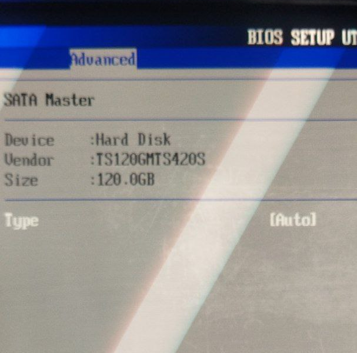

# HOW TO: EeePC 701 M.2 SSD mod
WORK IN PROGRESS!!!

## Table of contents

- [1. Disclaimer](#dislaimer)
- [2. I NEED YOUR HELP](#i-need-your-help)
- [3. Prerequisites](#prerequisites)
  - [3.1. Hardware needed](#hardware-needed)
  - [3.2. Software needed](#software-needed)
- [4. SSD Installation](#ssd-installation)
  - [4.2. Planning the position of converter](#)
  - [4.3. Modifying converter](#)
  - [4.4. Protecting mobo from shorting out](#)
  - [4.5. Soldering wires from FLASH_CON to converter](#)
  - [4.6. Checking the result](#)
- [5. Updating BIOS](#updating-bios)
  - [5.1. Why?](#why?)
  - [5.2. Choosing the way to flash](#choosing-the-way-to-flash)
  - [5.3. Checking the BIOS update result](#checking-the-BIOS-update-result)
- [6. Troubleshooting](#troubleshooting)
  - [6.1. SSD is not visible in BIOS](#ssd-is-not-visible-in-bios)
  - [6.2. ATA DMA errors in Linux](#)

## Disclaimer
Alright, i have no responsibility for broken legs, bones, or laptops.

## I NEED YOUR HELP
There is not a lot of information I have, so resources, any contributions to cover other models would be great!

## Prerequisites
There is collection of stuff you need to do this mod properly.

### Hardware needed

- __EeePC 701__ - mod was only proven to be successful on 701 4g model; I have no access to surf models. Yet.
- __M.2 SATA SSD__ - ONLY SATA M.2 SSD WILL WORK! NVME drives has no SATA support whatsoever.
- __SATA TO M.2 converter__ - the smaller the better, I've used some generic chinese one, with minor modifications, it fits perfectly.
- __EEPROM programmer__ - optional, there is no need to have it, but it might help you restore the BIOS in case of... something.

### Software needed

- __AFUDOS__ - BIOS flashing utility, get the image on release page, and just DD the image on flash drive. NOT THE ONLY WAY TO FLASH BIOS! <!-- TODO: more ways to flash -->
- __BIOS__ - I used [ASUS 701 With BIOS 900 ^_^](https://archive.org/details/bios_20230906), it is modded 900 BIOS to properly work on 701, was dumped from [some EeePC user](https://github.com/ninekeem)'s laptop, and from what i know it is from a dead EeePC forum.

## SSD Installation
<!-- TODO: installation proccess -->
...

...

...

## Updating BIOS

### Why?

The reason to update BIOS IS to have proper, working SATA support, because regular 701's BIOSes have broken support! why? i dont know... 

### Choosing the way to flash

- __AFUDOS__ - works just fine, but you need to force the write, because board ids or semething is mismatching(true for 900 BIOS mods).
- __EZ Flash__ - untested, difficult to find supported flash drive.
- __EEPROM programmer__ - should work 100%, but not as simple as other variants.

### Checking the BIOS update result

In case if everything is worked out just fine you should have SATA Menu in advanced tab:

## Troubleshooting

### SSD is not visible in BIOS

- __Mixing up SATA wires__ - causing laptop to freeze a bit (maybe?) and there is no ssd in BIOS.
- __No 3V are supplied to SSD__ - why? many reasons, check the wiring again.

### ATA DMA errors in Linux

- __BIOS broken SATA support__ - you're using wrong BIOS.